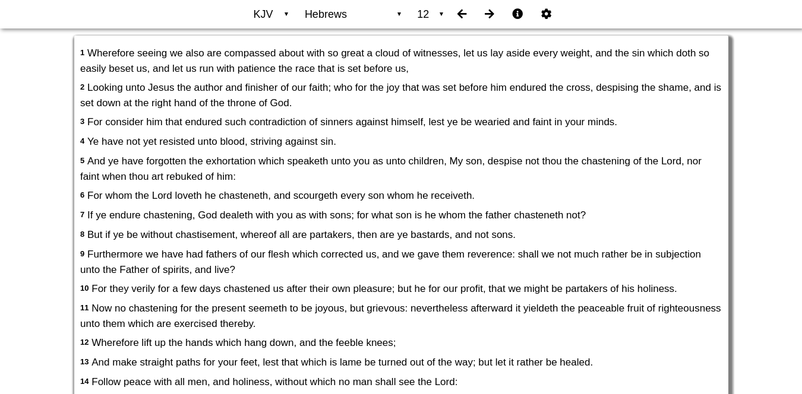

# Heb12 Desktop
Heb12 Desktop is a program for Windows and Linux that allows you to easily read the Bible on your computer.

The latest release of Heb12 Desktop is version 0.3.0, and version 0.4.0 will be released soon.

## Screenshots
Here are some screenshots of Heb12 Desktop.

### Normal Theme

Here are some screenshots of the default theme of Heb12 Desktop.

#### Reader mode

#### Info screen

#### Settings screen

### Dark Theme

Here are some screenshots of the dark theme of Heb12 Desktop.

#### Reader mode

#### Info screen

#### Settings Screen

## Install
We currently have pre-release versions of Heb12 Desktop available for those that want it.

### Windows
[Download the Windows version of Heb12](https://github.com/heb12/heb12/releases/download/v0.2.0/Heb12.Bible.Setup.0.2.0.exe).

Note: If you use McAfee anti-malware, the program might not install. This is a known issue and we are working on it.

### Linux
There are three different ways to install it on Linux.

- .deb
- .rpm
- .AppImage

The .deb file is used for Debian based distributions. If you use any of the distributions listed below, use the .deb package.

The .rpm file is used for Red Hat based distributions.

The .AppImage file can be run on all Linux distributions.

Get the files for Linux [here](https://github.com/heb12/heb12/releases).
